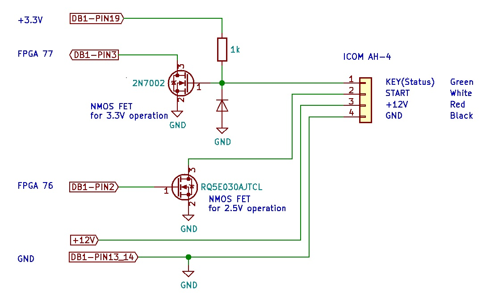
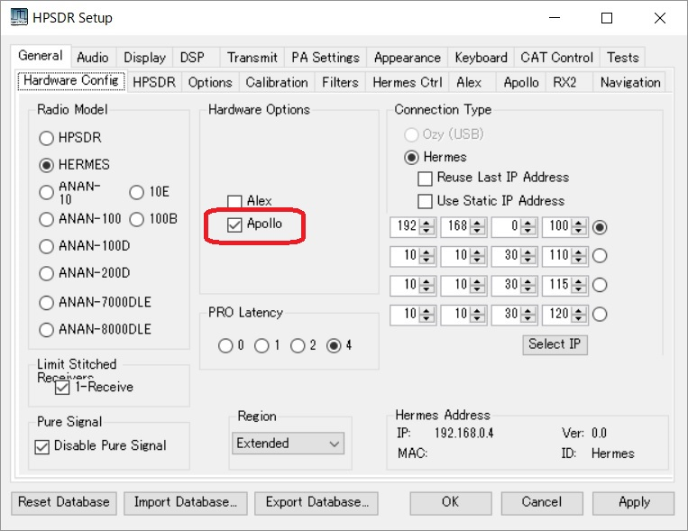
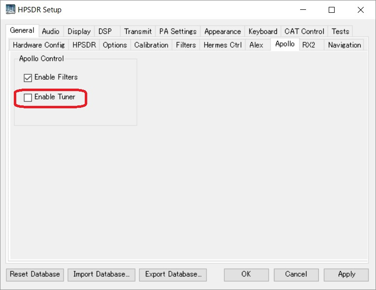
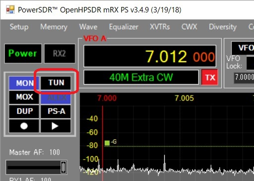
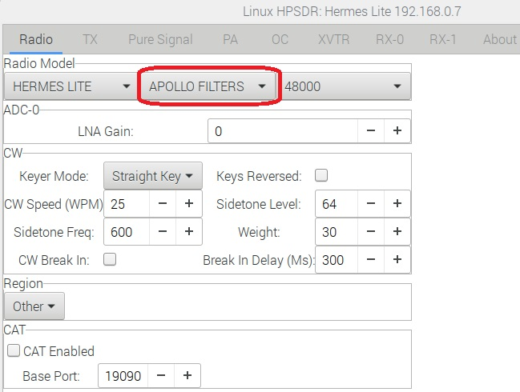
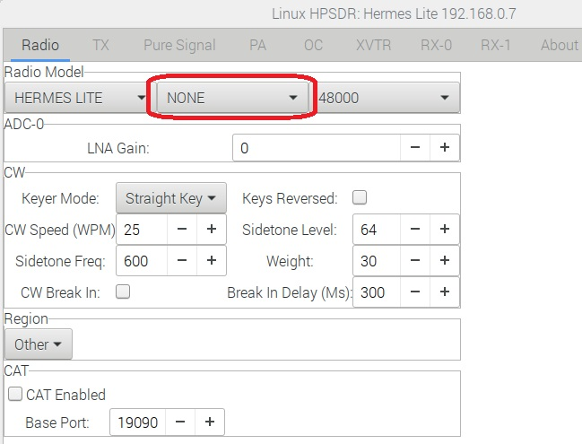
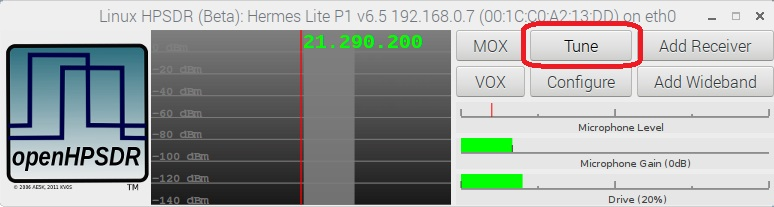

# ICOM ATU support function for Hermes-Lite Ver2

## Based on the official 20190616 gateware.

## Interface curcuit

## PowerSDR setting
- Hardware_Config TAB

- Apollo TAB (ATU ON)

- Apollo TAB (ATU OFF/Hold)

- Start ATU tuning

 Step1: Push TUNE buttun to start tuning. When tuning is completed, transmission is automatically stopped.
 Step2: Push TUNE button again to return to receiving.

## Linux HPSDR setting
- Configure (ATU ON)

- Configure (ATU OFF/Hold)

- Start ATU tuning

## Others
- Embedded 5W PA is always enabled.
- Tested with ICOM AH-4
- [_Control sequence_](https://github.com/ji1udd/Hermes-Lite2/blob/CompactTRX/compact-trx/powercontrol/docs/ATU_timing_chart.jpg)
